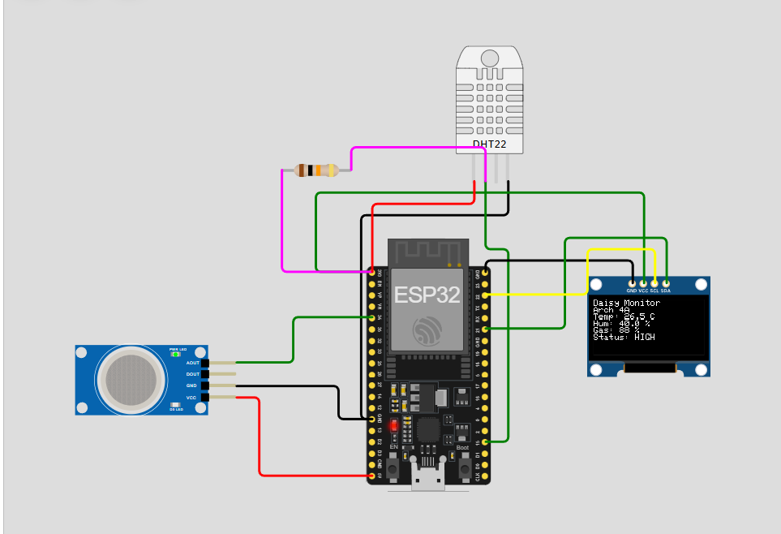
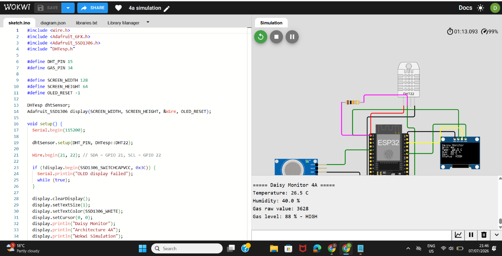
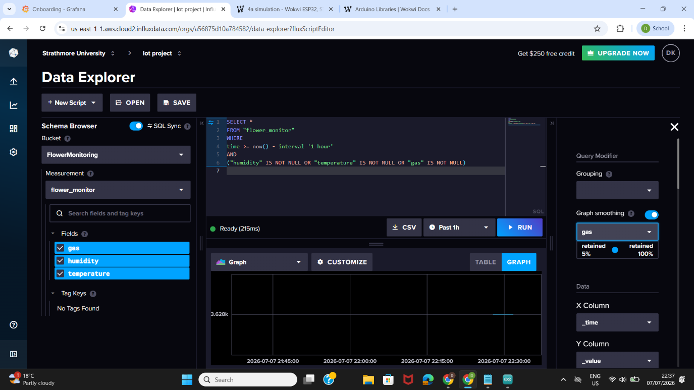
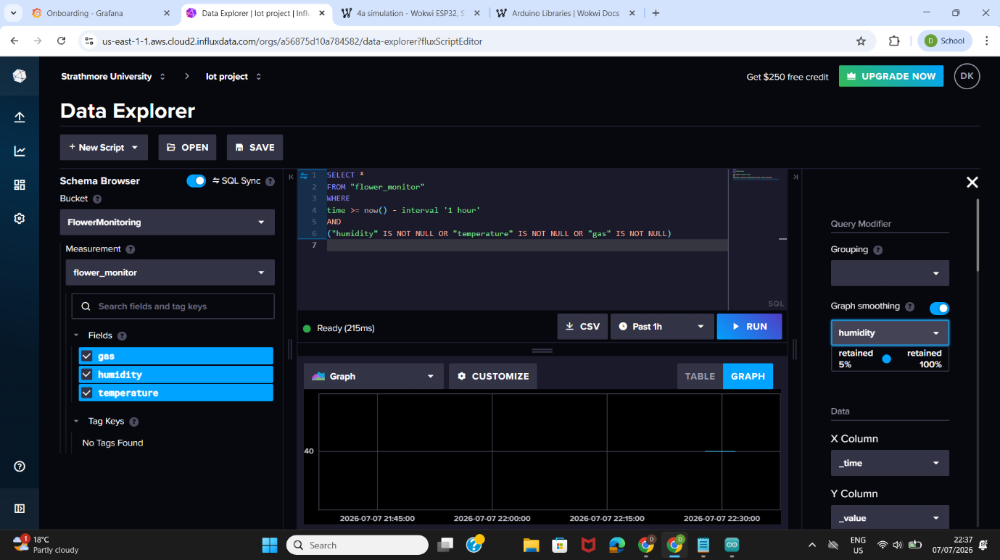
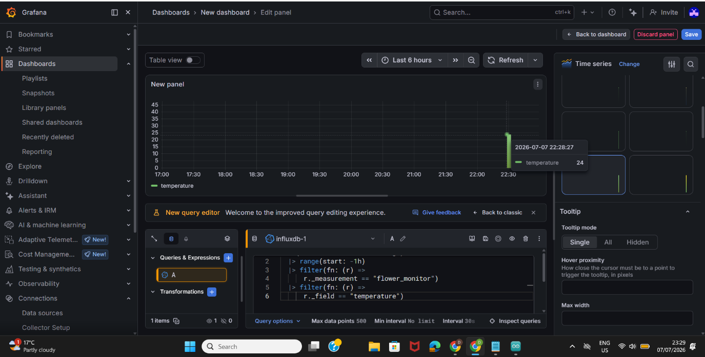
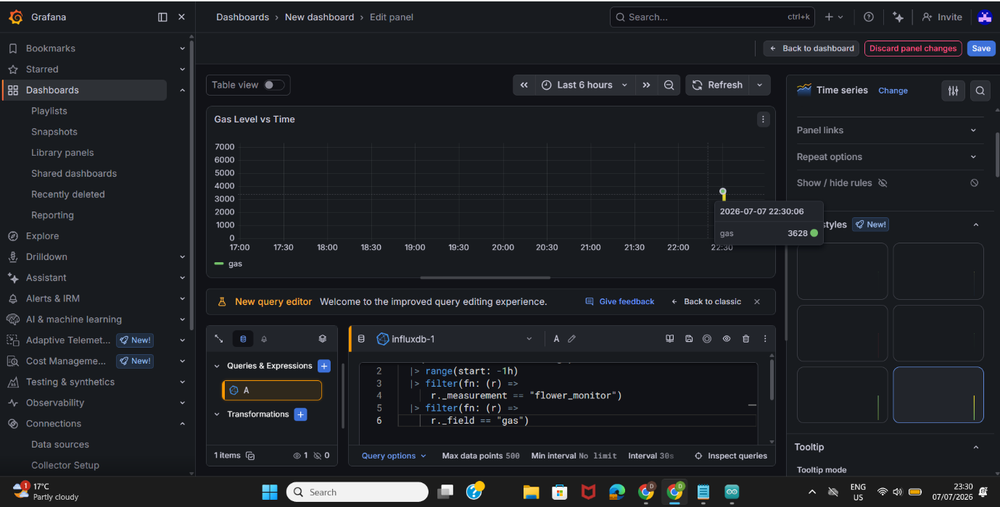
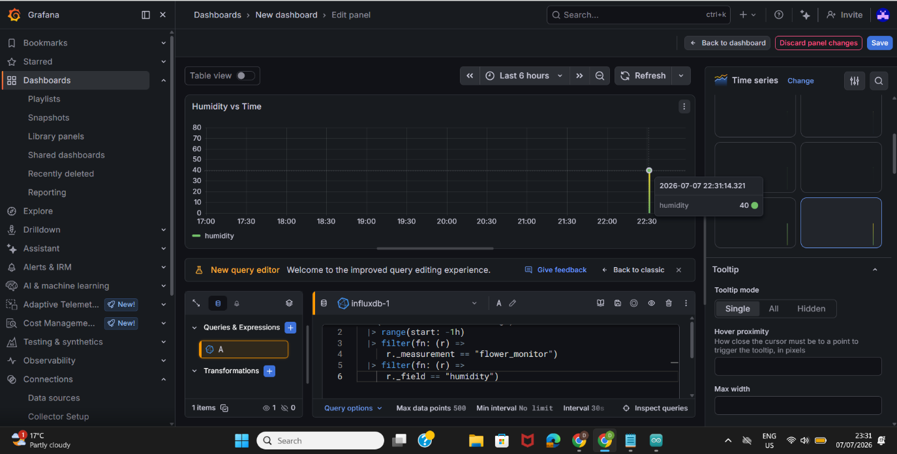
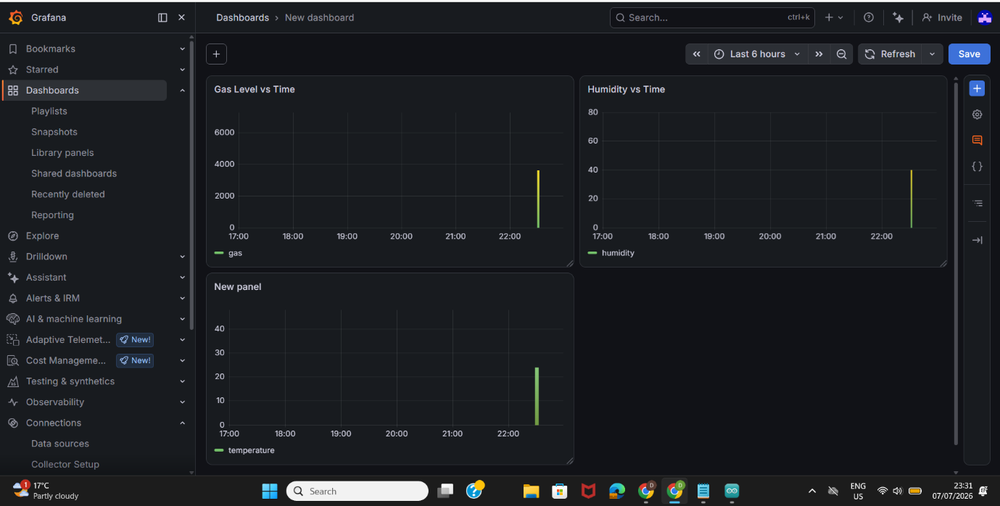
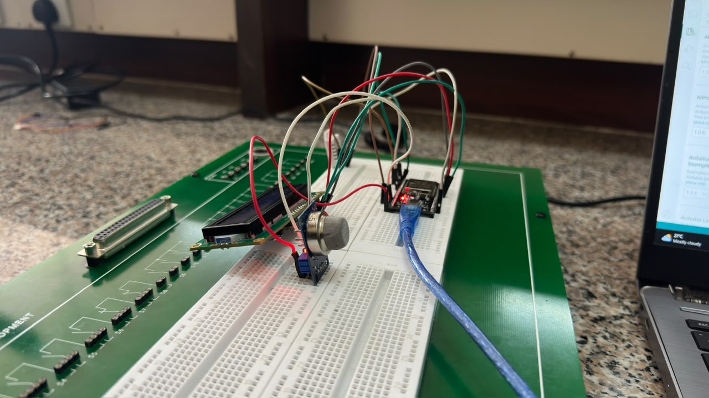
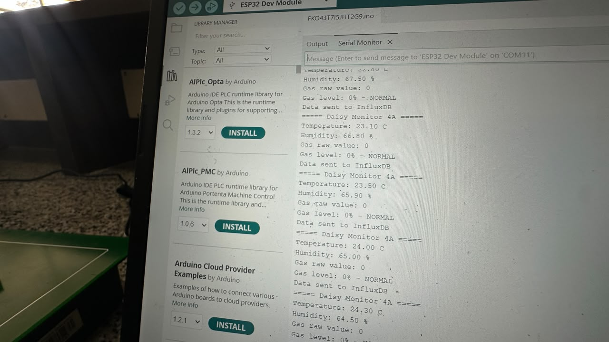

<u>**IoT DELIVARABLE 3**</u>

We did both a physical prototype and simulations:

<u>**1.SIMULATION**</u>

The embedded system was also implemented using the Wokwi online simulator. The simulation reproduces the hardware architecture consisting of one ESP32 connected to a DHT22 sensor, an MQ-series gas sensor (represented by the available MQ-2 model in Wokwi), and an SSD1306 OLED display. The simulation was used to validate the software logic before deployment on the physical hardware

https://wokwi.com/projects/467286122843350017

<u>4a</u>

During simulation, the DHT22 sensor values and gas sensor readings were varied to verify that the ESP32 correctly processed the inputs and updated both the OLED display and the Serial Monitor. The observed outputs matched the expected system behaviour, demonstrating that the application logic functions correctly within the simulated environment.

Influx visualizations

Sensor readings generated by the ESP32 were transmitted over Wi-Fi to InfluxDB, where they were stored as time-series data. Each record contained a timestamp together with the measured environmental values. The successful storage of the measurements confirmed that communication between the ESP32 and the cloud platform was functioning correctly.

1.Gas

2.Humidity

3.Temperature

Grafana Visualizations

Grafana was connected to the InfluxDB database to visualize the collected sensor data. A dashboard containing separate visualizations for temperature, humidity and gas concentration was created to support real-time monitoring and historical analysis. The dashboard updated automatically as new sensor readings were received.

1.Temperature

2.Gas

3.Humidity

<u>**2.**</u><u>**Physical**</u>

The physical prototype was assembled using an ESP32 DevKit microcontroller, a DHT22 temperature and humidity sensor, an MQ-5 gas sensor, and an OLED display. The circuit was constructed on a breadboard using jumper wires and the necessary resistors. The ESP32 continuously reads environmental conditions from the sensors, displays the measurements on the OLED screen, and outputs the same readings through the Serial Monitor. This prototype demonstrates the successful integration of the hardware components before cloud transmission.

The Arduino IDE Serial Monitor was used to verify the sensor readings during testing. Temperature, humidity and gas measurements were printed at regular intervals to confirm that the ESP32 was correctly acquiring sensor data before transmission to the cloud.

Challenges

During the development of the **physical prototype**, the OLED display and MQ-5 gas sensor did not function as expected. The OLED display failed to show sensor readings consistently, while the MQ-5 sensor did not produce stable or reliable gas readings. Several troubleshooting steps were attempted, including checking the circuit wiring, verifying power supply connections, confirming the GPIO pin assignments, and reviewing the program code. Despite these efforts, the issues could not be fully resolved within the available development time. To demonstrate the intended system functionality, the Wokwi simulation was used to validate the embedded application logic, while the physical prototype remained useful for demonstrating the hardware setup. Future work will involve replacing suspected faulty components and retesting the circuit to achieve full functionality.
