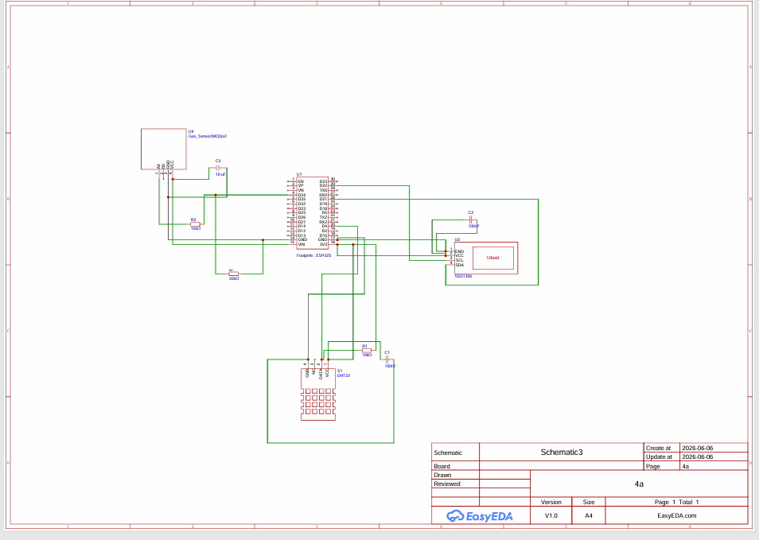
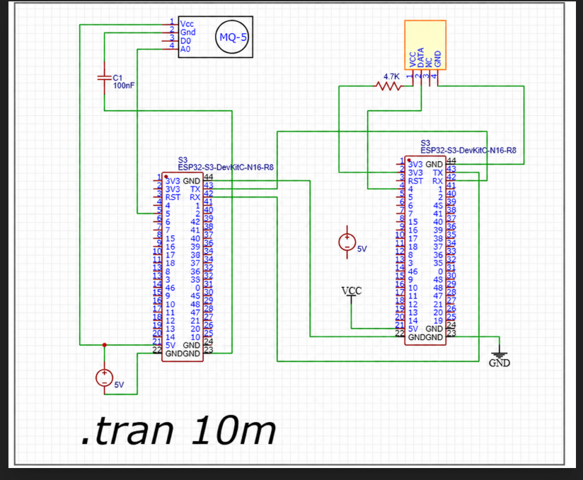
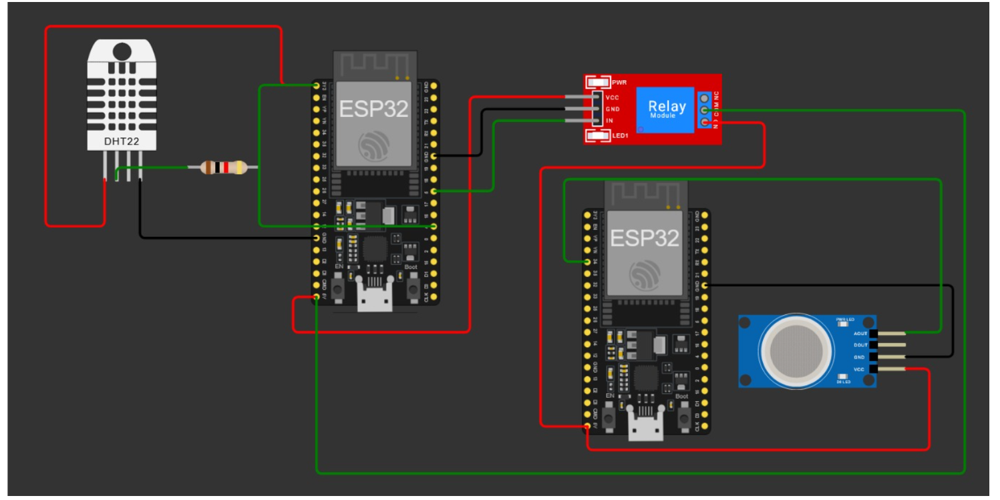
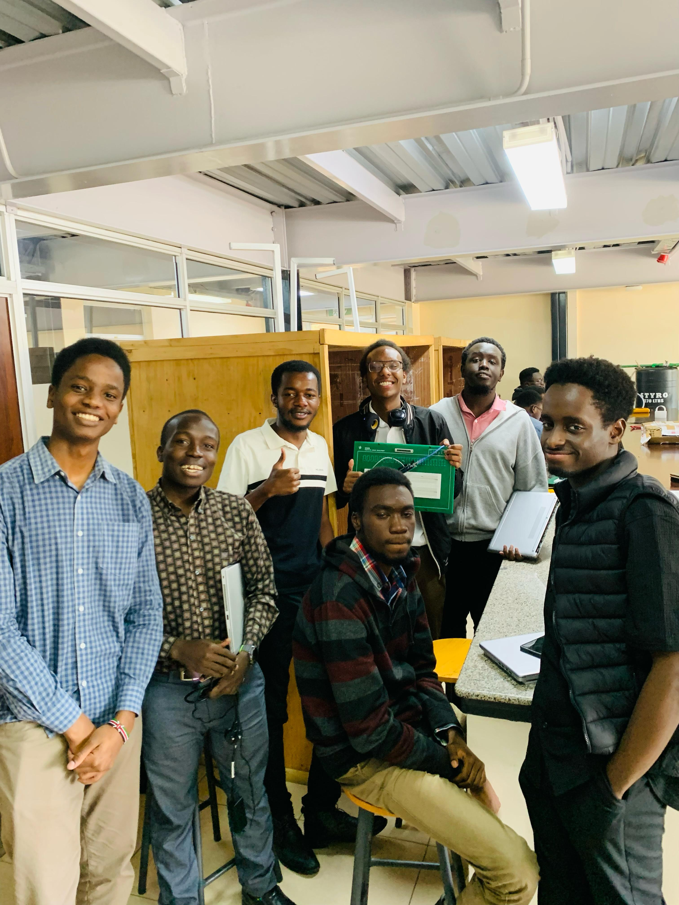

# ICS 4111 Semester Project: Deliverable 1

**Items 1-3: Daisy Growth Requirements, Hardware Components and Datasheet Links**

## Assigned Flower

Our assigned flower is daisies. For this deliverable, the daisy type used for the research is the Shasta/Common Garden Daisy . The values below will guide the monitoring thresholds for our embedded system prototype.

## 1. Environmental Requirements for Proper Growth of Daisies

The table below gives the environmental measurements needed for daisy growth and the practical monitoring target our group can use later when setting sensor thresholds. Some sensors, especially soil moisture and gas sensors, require calibration, so the prototype target is written in a way that can be tested and adjusted during implementation.

| Environmental characteristic | Recommended range or condition | Prototype monitoring target | Source/justification |
| --- | --- | --- | --- |
| Temperature | 15-24 °C. Sakata gives an optimum growing temperature of 15-21 °C for Shasta Daisy Snow Lady. | Normal: 15-24 °C. Warning: below 15 °C or above 30 °C for long periods. | [S2] |
| Relative humidity | 40%-60% RH as the project target. Prolonged high humidity should be avoided because Shasta daisies are prone to mildew/fungal problems in humid or wet conditions. | Normal: 40%-60% RH. Warning: above 70% RH for long periods, especially with poor airflow. | [S3], [S4] |
| Soil type | Well-drained, moderately fertile soil. Loam is preferred, although Shasta daisies can tolerate several soil textures if drainage is good. | Use well-drained garden soil or potting mix. Avoid waterlogged soil. | [S1], [S3] |
| Soil moisture content | Moderate to moist soil, but not soggy. This is converted into a practical sensor target through calibration. | Calibrate the capacitive soil moisture sensor using dry soil and wet soil readings. Target: Normal zone, about 40%-60% of the calibrated sensor scale. Dry: below 40%. Wet/waterlogged: above 60%. | [S1], [S4] |
| Soil pH | Target near-neutral soil. Suggested project range: 6.0-7.0. Acceptable researched range: about 5.8-7.0 depending on source and variety. | Normal: 6.0-7.0. Warning: below 5.8 or above 7.5. | [S1], [S2], [S3] |
| Sunlight exposure | Full sun: at least 6 hours of direct sunlight per day. | Target: record at least 6 hours of strong daylight per day using the light sensor. Low-light warning if daily strong-light time is below 6 hours. | [S1], [S3] |
| LPG / methane / propane / butane | Not a flower-growth requirement, but included requires LPG-related gas measurement. MQ-5 detects LPG-related gases and has a detection range of about 300-10,000 ppm for CH4/C3H8. | After MQ-5 preheating and baseline calibration, normal should be close to the clean-air baseline. Warning if readings rise above the calibrated baseline for repeated readings, or if the system is calibrated to an LPG threshold within the MQ-5 range. | [S9] |

Note: The 40%-60% soil moisture value above is not presented as a universal volumetric water content for all soils. It is a calibrated sensor scale for this prototype, based on dry and wet reference readings. This makes the value measurable during implementation without pretending that every soil gives the same sensor percentage.

## 2. Suitable Hardware Components Required

The following components are suitable for monitoring the daisy requirements listed above and for building the required embedded system architectures.

### Required components from the project brief

2 x ESP32S DevKit WiFi + BLE Module, 30-pin: main microcontroller boards used for sensing, processing and communication between architectures.

1 x 1.3 inch White I2C 128 x 64 OLED LCD: displays live readings such as temperature, humidity, soil moisture, pH, light level and gas status.

1 x DHT22 / AM2302 temperature and humidity sensor: measures air temperature and relative humidity around the flower.

1 x MQ-5 LPG/natural gas/coal gas sensor module: monitors LPG-related gases such as methane, propane and butane. Its analog output must be protected before connecting to the ESP32 ADC.

1 x 5V 1-channel low-level trigger relay module: used to switch an external load such as a fan, buzzer, lamp or pump during demonstration.

### Extra sensors needed to monitor the daisy growth requirements

1 x Capacitive soil moisture sensor, such as DFRobot SEN0193 or equivalent: measures soil moisture and is less prone to corrosion than a resistive moisture probe.

1 x Soil pH sensor kit, such as DFRobot SEN0161 or equivalent: measures whether the soil is within the pH range suitable for daisies.

1 x BH1750/GY-302 digital light sensor: measures light intensity so the system can estimate daily sunlight exposure.

### Prototyping and electrical components

2 x breadboards for testing the ESP32 boards and sensor connections.

Jumper wires: male-to-male, male-to-female and female-to-female for breadboard and module wiring.

2 x USB cables for programming and powering the ESP32 boards during testing.

1 x 5V 2A power supply or USB adapter for stable power, especially for MQ-5 and relay testing.

Resistors: 10 kΩ for DHT22 pull-up if needed, 20 kΩ and 10 kΩ for an MQ-5 analog voltage divider, and 220 Ω or 330 Ω for LED current limiting.

Capacitors: 100 nF for local decoupling near sensors, 10 µF for smoothing module supply lines and 470 µF near the 5V supply if the relay/MQ-5 causes voltage dips.

1 x LED and/or buzzer for simple alarm indication during testing.

1 x multimeter for checking voltage levels, continuity and common ground connections before powering the circuit.

ESP32 GPIO pins use 3.3V logic, so any 5V sensor output must not be connected directly to an ESP32 input. The MQ-5 analog output should pass through a voltage divider before reaching an ESP32 ADC pin. All connected modules that exchange signals must share a common ground, unless full relay isolation is intentionally used.

## 3. Datasheet and Product Documentation Links

The links below cover the required five components from the project brief and the extra sensors included in the hardware list.

### Required project components

ESP32S DevKit WiFi + BLE Module, 30-pin: [[S5] Espressif - ESP32-DevKitC V4 Getting Started Guide](https://docs.espressif.com/projects/esp-idf/en/v5.1/esp32/hw-reference/esp32/get-started-devkitc.html); [[S6] Espressif - ESP32-WROOM-32E & ESP32-WROOM-32UE Datasheet](https://www.espressif.com/sites/default/files/documentation/esp32-wroom-32e_esp32-wroom-32ue_datasheet_en.pdf)

1.3 inch White I2C 128 x 64 OLED LCD: [[S7] OLED 1.3 inch I2C 128x64 Module Guide](https://robu-prod-media.s3.ap-south-1.amazonaws.com/uploads/2019/12/1.3-Inch-I2C-IIC-OLED-LCD-Module-4pin-with-VCC-GND-Blue-1.pdf)

DHT22 / AM2302 temperature and humidity sensor: [[S8] SparkFun - DHT22 / AM2302 Datasheet](https://cdn.sparkfun.com/assets/f/7/d/9/c/DHT22.pdf)

MQ-5 LPG, natural gas and coal gas sensor: [[S9] Winsen - MQ-5 Flammable Gas Sensor Manual](https://www.winsen-sensor.com/d/files/MQ-5.pdf)

5V 1-channel low-level trigger relay module: [[S10] Handson Technology - 5V 1 Channel Low Level Relay Module User Guide](https://handsontec.com/dataspecs/relay/1Ch-relay.pdf)

### Extra sensors used for the daisy monitoring system

Capacitive soil moisture sensor: [[S11] DFRobot SEN0193 - Capacitive Soil Moisture Sensor](https://media.digikey.com/pdf/data%20sheets/dfrobot%20pdfs/sen0193_web.pdf)

BH1750 digital light sensor: [[S12] ROHM - BH1750FVI Digital Light Sensor Datasheet](https://www.mouser.com/datasheet/2/348/bh1750fvi-e-186247.pdf)

Soil pH sensor kit: [[S13] DFRobot - SEN0161 Analog pH Sensor Kit Wiki](https://wiki.dfrobot.com/sen0161/)

### Plant growth sources used for Item 1

[[S1] NC State Extension - Leucanthemum x superbum (Shasta Daisy)](https://plants.ces.ncsu.edu/plants/leucanthemum-x-superbum/)

[[S2] Sakata Ornamentals - Shasta Daisy Snow Lady Cultural Information](https://sakataornamentals.com/wp-content/uploads/sites/13/2022/02/Shasta-Daisy-Snow-Lady-1024-SAKATA.pdf)

[[S3] Better Homes & Gardens - How to Plant and Grow Shasta Daisy](https://www.bhg.com/gardening/plant-dictionary/perennial/shasta-daisy/)

[[S4] Proven Winners - Perennial Culture Information for Amazing Daisies](https://www.provenwinners.com/sites/provenwinners.com/files/images/professional/catalogs/5_perennial_section_2018_canada.pdf)

## 4A

## 4B

## 4C

## Groupwork Evidence

